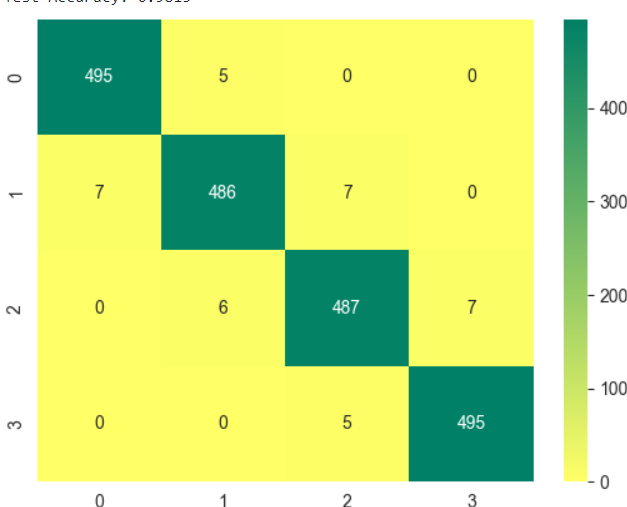

# FitnessApp (NEAR FIELD COMMUNICATION).

#### HOW TO SETUP ON LOCAL Development:

you need to install python =>3.10

#### create new env:

```shell
         # Create the project directory
        mkdir venv
        
        # Create a virtual environment to isolate our package dependencies locally
        python3 -m venv venv
        source venv/scripts/activate  # On Windows use `env\Scripts\activate`
        
        # Install requirements into the virtual environment
        pip install -r requirements.txt
        python3 manage.py makemigrations
        python3 manage.py migrate
        
        
```

create new file with the name  **.env file:**
and make sure to have all things critical in it

## Run the server

`python3 manage.py runserver`


-----

# Response class

This class unifies the responses for all the apis

Where every response should contain:

- data
- status
- message
- success
- pagination info ( if you enable pagination )

* If you want to paginate data you must call ```response.paginate( request, data)```, then
  call ```response.collect(status, message, data, is_paginte)```

    - status: ```it's value is ( 200, 400, 401, 404, 500, ... ) it's default value is 200```.
    - status: ```*string``` describe response ```it's default value empty```.
    - data: ```*array``` express the data you want to send with response
      ```default value is [] if you call response.paginate before response.collect```<br/>
    

### Project Structure 
```shell
device-price-classification-project
---->micro_services
   ----> base # (this have base class api, baseresponse... ) 
   ----> device # (device service )
         ---->crons #(In order to send notifications in a scheduled and organized manner)
              ----> not_start_training_program_notification_cron # send notifications in not start program case
              ----> finishes_training_program_notification_cron # send notifications in finished program case
         ----> reposiories # (this handle apis and respose for fitness app )
              ----> event #: have event apis
                    ----> platform #: this in case we will have multi platforms in future (website, dahboard, mobile...)
                          ----> commom #: this have common apis and serializers between (website, dahboard, mobile...) 
                          ----> mobile: ...
                          ...
                          ...
                    ----> TDD # : this folder have TestCase for events in every platforms 
          
----> settings # (configration projects (database, apps, ...) )
----> urls #  content v1 urls
```
##### Train Accuracy: 0.9914285714285714

##### POST MAN
 

 ##### Test Accuracy: 0.9815
